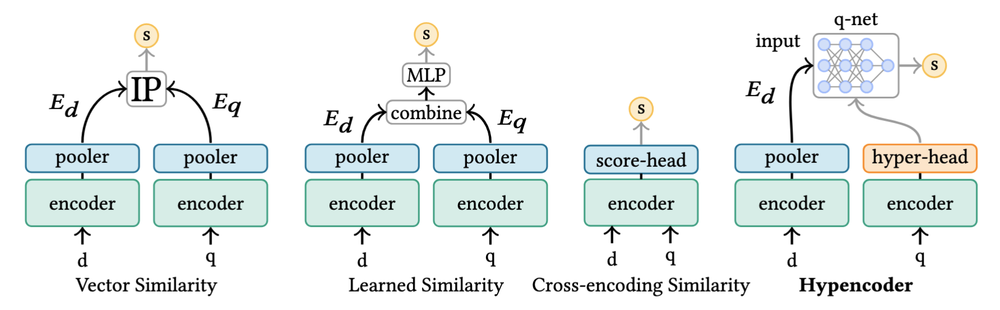

# Hypencoder
Official Repository for "Hypencoder: Hypernetworks for Information Retrieval".

🚨 This repo is currently a work-in-progress 🚨

Todos:
- [x] Publish core modeling code.
- [x] Publish inference, retrieval, and evaluation code.
- [x] Confirm that inference, retrieval, and evaluation code work correctly.
- [x] Upload Hypencoder checkpoints.
- [x] Write instillation and quick start guides.
- [x] Write replication commands for in-domain and out-of-domain results.
- [ ] Add training files and configs used for training.
- [ ] Upload all training data.
- [ ] Upload BE-Base checkpoint.
- [ ] Add retrieval functionality for bi-encoders.
- [ ] Add additional files used for harder retrieval tasks.
- [ ] Add run files for all evaluation datasets.
- [ ] Add code for approximate search.
- [ ] Upload passage embeddings for MSMARCO.




<h4 align="center">
    <p>
        <a href=#installation>Installation</a> |
        <a href=#quick-start>Quick Start</a> |
        <a href="https://arxiv.org/pdf/2502.05364">Paper</a> |
        <a href=#models>Models</a> |
        <a href="#cite">Citation</a>
    <p>
</h4>

## Installation
### Copy the Repo
```
gh repo clone jfkback/hypencoder-paper
```

### Install locally with pip
```
pip install -e /hypencoder-paper
```

### Required Libraries
The core libraries required are:
- `torch`
- `transformers`

with just the core libraries you can use Hypencoder to create q-nets and
document embeddings.

To use the code for encoding and retrieval the following additional libraries
are required:
- `fire`
- `tqdm`
- `ir_datasets`
- `jsonlines`
- `docarray`
- `numpy`
- `ir_measures`


## Quick Start
#### Using the pretrained Hypencoders as stand-alone models
```python
from hypencoder_cb.modeling.hypencoder import Hypencoder, HypencoderDualEncoder, TextEncoder
from transformers import AutoTokenizer

dual_encoder = HypencoderDualEncoder.from_pretrained("jfkback/hypencoder.6_layer")
tokenizer = AutoTokenizer.from_pretrained("jfkback/hypencoder.6_layer")

query_encoder: Hypencoder = dual_encoder.query_encoder
passage_encoder: TextEncoder = dual_encoder.passage_encoder

queries = [
    "how many states are there in india",
    "when do concussion symptoms appear",
]

passages = [
    "India has 28 states and 8 union territories.",
    "Concussion symptoms can appear immediately or up to 72 hours after the injury.",
]

query_inputs = tokenizer(queries, return_tensors="pt", padding=True, truncation=True)
passage_inputs = tokenizer(passages, return_tensors="pt", padding=True, truncation=True)

q_nets = query_encoder(input_ids=query_inputs["input_ids"], attention_mask=query_inputs["attention_mask"]).representation
passage_embeddings = passage_encoder(input_ids=passage_inputs["input_ids"], attention_mask=passage_inputs["attention_mask"]).representation

# The passage_embeddings has shape (2, 768), but the q_nets expect the shape
# (num_queries, num_items_per_query, input_hidden_size) so we need to reshape
# the passage_embeddings.

# In the simple case where each q_net only takes one passage, we can just
# reshape the passage_embeddings to (num_queries, 1, input_hidden_size).
passage_embeddings_single = passage_embeddings.unsqueeze(1)
scores = q_nets(passage_embeddings_single)  # Shape (2, 1, 1)
# [
#    [[-12.1192]],
#    [[-13.5832]]
# ]

# In the case where each q_net takes both passages we can reshape the
# passage_embeddings to (num_queries, 2, input_hidden_size).
passage_embeddings_double = passage_embeddings.repeat(2, 1).reshape(2, 2, -1)
scores = q_nets(passage_embeddings_double)  # Shape (2, 2, 1)
# [
#    [[-12.1192], [-32.7046]],
#    [[-34.0934], [-13.5832]]
# ]
```

#### Encoding and Retrieving
If the queries and documents you want to retrieve exist as a dataset in the IR Dataset library no additional work is needed to encode and retrieve from the dataset. If the data is not a part of this library you will need two JSONL files for the documents and queries. These must have the format:
```
{"<id_key>": "afei1243", "<text_key>": "This is some text"}
...
```
where `<id_key>` and `<text_key>` can be any string and do not have to be the same for the document and query file.

##### Encoding
```
export ENCODING_PATH="..."
export MODEL_NAME_OR_PATH="jfkback/hypencoder.6_layer"
python hypencoder_cb/inference/encode.py \
--model_name_or_path=$MODEL_NAME_OR_PATH \
--output_path=$ENCODING_PATH \
--jsonl_path=path/to/documents.jsonl \
--item_id_key=<id_key> \
--item_text_key=<text_key>
```
For all the arguments and information on using IR Datasets type:
`python hypencoder_cb/inference/encode.py --help`.

##### Retrieve
The values of `ENCODING_PATH` and `MODEL_NAME_OR_PATH` should be the same as
those used in the encoding step.
```
export ENCODING_PATH="..."
export MODEL_NAME_OR_PATH="jfkback/hypencoder.6_layer"
export RETRIEVAL_DIR="..."
python hypencoder_cb/inference/retrieve.py \
--model_name_or_path=$MODEL_NAME_OR_PATH \
--encoded_item_path=$ENCODING_PATH \
--output_dir=$RETRIEVAL_DIR \
--query_jsonl=path/to/queries.jsonl \
--do_eval=False \
--query_id_key=<id_key> \
--query_text_key=<text_key> \
--query_max_length=64 \
--top_k=1000
```
For all the arguments and information on using IR Datasets type:
`python hypencoder_cb/inference/retrieve.py --help`.

##### Evaluation
Evaluation is done automatically when `hypencoder_cb/inference/retrieve.py` is called so long as `--do_eval=True`. If you are not using an IR Dataset you will need to provide the qrels with the argument `--qrel_json`. The qrels JSON should be in the format:
```
{
    "qid1": {
        "pid8": relevance_value (float),
        "pid65": relevance_value (float),
        ...
    }.
    "qid2": {
        ...
    },
    ...
}
```

#### Custom Q-Nets
In the paper we only looked at simple linear q-nets but in theory any type of neural network can be used. The code in this repository is flexible enough to support any q-net whose only learnable parameters can be expressed as a set of matrices and vectors. This should include almost every neural network.

To build a custom q-net you will need to make a new q-net converter similar to the existing one `RepeatedDenseBlockConverter`. This converter must have the following functions and properties:
1. `weight_shapes` should be a property which is a list of tuples indicating the size of the weight matrices.
2. `bias_shapes` should be a property which is a list of tuples indicating the size of the bias vectors.
3. `__call__` which takes three arguments `matrices`, `vectors`,  and `is_training`. See `RepeatedDenseBlockConverter` for details on the type of these arguments. This method should
return a callable object which excepts a torch tensor in the shape (num_queries, num_items_per_query, hidden_dim) and returns a tensor with the shape (num_queries, num_items_per_query, 1) which contains the relevance score for each query and associated item.


## Models
We have uploaded the models from our paper experiments to Huggingface Hub. See quick start for more information on how to use these models.
<center>

| Huggingface Repo | Number of Layers |
|:------------------:|:------------------:|
| [jfkback/hypencoder.2_layer](https://huggingface.co/jfkback/hypencoder.2_layer) |          2        |
| [jfkback/hypencoder.4_layer](https://huggingface.co/jfkback/hypencoder.4_layer) |          4        |
| [jfkback/hypencoder.6_layer](https://huggingface.co/jfkback/hypencoder.6_layer) |          6        |
| [jfkback/hypencoder.8_layer](https://huggingface.co/jfkback/hypencoder.8_layer) |          8        |
</center>

## Citation
```
@misc{killingback2025hypencoderhypernetworksinformationretrieval,
      title={Hypencoder: Hypernetworks for Information Retrieval},
      author={Julian Killingback and Hansi Zeng and Hamed Zamani},
      year={2025},
      eprint={2502.05364},
      archivePrefix={arXiv},
      primaryClass={cs.IR},
      url={https://arxiv.org/abs/2502.05364},
}
```